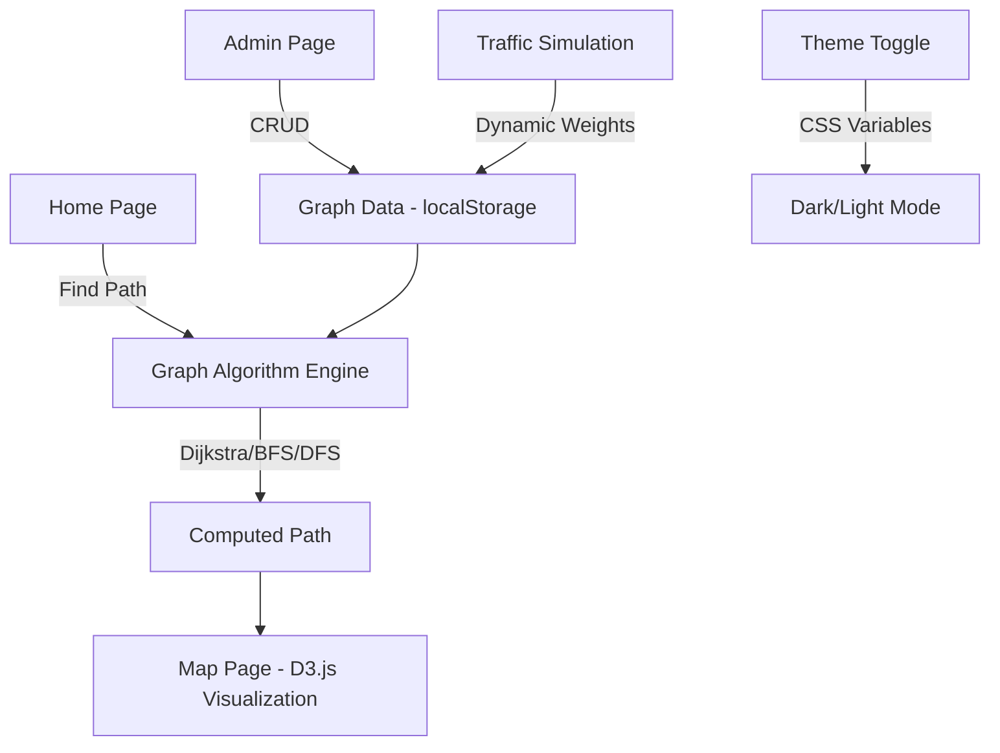

# City Navigation Web Application — Implementation Plan

## Overview

Build a stunning, interactive City Navigation Web App that lets users find the shortest path between locations using Dijkstra's algorithm, with beautiful D3.js graph visualization, dark/light mode, and an admin panel for managing the city graph.

---

## User Review Required

> [!IMPORTANT]
> **Tech Stack Decision**: I'll use **Vite + React** (no backend server needed). All graph algorithms run client-side for instant results. Graph data is stored in **localStorage** (no Firebase setup required). This keeps the project self-contained and easy to run. If you want a Node.js backend + Firebase instead, let me know.

> [!IMPORTANT]
> **Graph Library**: I'll use **D3.js** for graph visualization — it gives full control over the look and feel of nodes, edges, animations, and path highlighting. Alternatively, I could use React Flow. Let me know your preference.

> [!WARNING]
> **Google Maps API**: The PRD mentions optional Google Maps integration. I'll build the app with a **custom graph visualization** (not Google Maps). The graph will represent a fictional city with realistic locations. Real-world map integration can be added later if needed.

---

## Proposed Changes

### 1. Project Scaffold

#### [NEW] Project initialization with Vite + React
- Initialize a Vite React project in the workspace
- Install dependencies: `d3`, `react-router-dom`, `lucide-react` (icons)
- Configure project structure

---

### 2. Core Algorithm Engine

#### [NEW] [graph.js](file:///c:/DSA-%20project/src/utils/graph.js)
- `Graph` class with methods:
  - `addNode(id, name, x, y)` — add a location
  - `addEdge(source, dest, distance, oneWay)` — add a road
  - `removeNode(id)` / `removeEdge(source, dest)`
  - `dijkstra(source, dest)` → returns `{ path, distance, visited }`
  - `bfs(source, dest)` → returns `{ path, visited }`
  - `dfs(source, dest)` → returns `{ path, visited }`
  - `getAllPaths(source, dest, limit)` → returns multiple routes

#### [NEW] [cityData.js](file:///c:/DSA-%20project/src/data/cityData.js)
- Pre-built city graph with ~15-20 realistic locations
- Named locations (e.g., "Central Station", "City Park", "Airport")
- Weighted edges representing distances/travel times
- Mix of one-way and two-way roads

---

### 3. State Management

#### [NEW] [GraphContext.jsx](file:///c:/DSA-%20project/src/context/GraphContext.jsx)
- React Context for global graph state
- Holds: nodes, edges, theme, selected source/dest, computed paths
- Persists graph data to `localStorage`
- Provides actions: addNode, removeNode, addEdge, removeEdge, computePath, toggleTheme

---

### 4. Pages & Routing

#### [NEW] [App.jsx](file:///c:/DSA-%20project/src/App.jsx)
- React Router setup with 3 pages
- Global layout with navbar

#### [NEW] [HomePage.jsx](file:///c:/DSA-%20project/src/pages/HomePage.jsx)
- Hero section with animated background
- Source & destination dropdowns (searchable)
- Algorithm selector (Dijkstra / BFS / DFS)
- "Find Path" and "Reset" buttons
- Quick stats display (total nodes, edges)

#### [NEW] [MapPage.jsx](file:///c:/DSA-%20project/src/pages/MapPage.jsx)
- Full-screen D3.js graph visualization
- Interactive: pan, zoom, hover for node info
- Shortest path highlighted in **green**
- Alternative routes in **gray**
- Side panel showing:
  - Route steps
  - Total distance / estimated time
  - Algorithm used
  - Nodes visited during computation
- Animation of path discovery (step-by-step Dijkstra visualization)

#### [NEW] [AdminPage.jsx](file:///c:/DSA-%20project/src/pages/AdminPage.jsx)
- Add/remove nodes (name + position)
- Add/remove edges (source, dest, weight, one-way toggle)
- Live graph preview
- Reset to default city data
- Import/Export graph as JSON

---

### 5. Components

#### [NEW] [Navbar.jsx](file:///c:/DSA-%20project/src/components/Navbar.jsx)
- Navigation links (Home, Map, Admin)
- Dark/Light mode toggle with smooth transition
- App logo/title

#### [NEW] [GraphVisualization.jsx](file:///c:/DSA-%20project/src/components/GraphVisualization.jsx)
- D3.js force-directed or fixed-position graph
- Nodes as labeled circles with location names
- Edges as lines with distance labels
- Color-coded path highlighting
- Animated path traversal
- Zoom/pan controls

#### [NEW] [RoutePanel.jsx](file:///c:/DSA-%20project/src/components/RoutePanel.jsx)
- Shows computed route details
- Step-by-step directions
- Distance and estimated time
- Compare multiple routes

#### [NEW] [PathInput.jsx](file:///c:/DSA-%20project/src/components/PathInput.jsx)
- Source/destination dropdown selectors
- Algorithm choice radio buttons
- Find Path button with loading animation

#### [NEW] [NodeForm.jsx](file:///c:/DSA-%20project/src/components/NodeForm.jsx) / [EdgeForm.jsx](file:///c:/DSA-%20project/src/components/EdgeForm.jsx)
- Admin forms to add nodes/edges
- Validation and error messages

---

### 6. Styling & Theme

#### [NEW] [index.css](file:///c:/DSA-%20project/src/index.css)
- CSS custom properties for theming (light/dark)
- Glassmorphism effects
- Smooth transitions & micro-animations
- Responsive breakpoints
- Google Fonts (Inter)
- Gradient backgrounds
- Premium card designs

---

### 7. Traffic Simulation (Advanced Feature)

#### [NEW] [trafficSimulation.js](file:///c:/DSA-%20project/src/utils/trafficSimulation.js)
- Randomly adjusts edge weights to simulate live traffic
- Visual indicators (green/yellow/red) on edges
- Toggle simulation on/off from UI

---

## Architecture

## Open Questions

> [!IMPORTANT]
> 1. **Do you want Firebase integration**, or is localStorage sufficient for this project?
> 2. **Do you want a Node.js backend**, or is a fully client-side app acceptable?
> 3. **Any specific city** you'd like the default graph to represent, or should I create a fictional city?
> 4. **Voice directions** — should I implement this, or skip for now?

## Verification Plan

### Automated Tests
- Run `npm run dev` to start the dev server
- Verify all three pages render correctly
- Test pathfinding with various source/destination combinations
- Test admin CRUD operations
- Test dark/light mode toggle
- Test responsive layout at different viewport sizes

### Manual Verification
- Visual inspection of graph rendering in browser
- Verify Dijkstra produces correct shortest paths
- Test edge cases (same source & dest, unreachable nodes)
- Check animations and transitions are smooth
